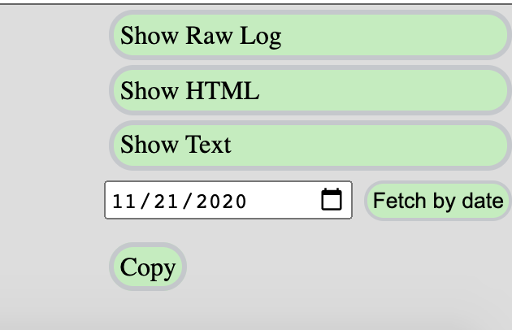

# Generate CCG Minutes

## Step 1: Fetch and clean up the log file

Go to the [scribe tool](https://w3c-ccg.github.io/meetings/scribe-tool/) and enter the date of the meeting (see screenshot)

Check the following:
- Ensure there's a link to the agenda ("Agenda: ...")
- Ensure the topics are labeled ("Topic: ...")
- Ensure the scribe is identified ("Scribe: ...")
- Look for any find/replace suggestions in irc.log and update them ("s/../..")
- Ensure aliases have matches (see [people.json file](https://github.com/w3c-ccg/meetings/blob/gh-pages/scribe-tool/people.json))
- Download the IRC log by selecting and copying (you can use the copy button in the interface) the IRC log text, and pasting into a new file on your computer using any text editor (eg. Notepad, TextEdit, Sublime Text) and save it with the filename `irc.log`. 

## Step 2: Fetch and clean audio (TODO)

### Step 2a: if you used Jitsi
- You can use the `download-raw-minutes` tool in the `w3c-ccg/meetings` repository.
    - For example, to download the audio for 2020-09-29 weekly meeting into `2020-09-29`:
    `./download-raw-minutes -a 2020-09-29`
    - For example, to download the audio for 2020-11-02 education meeting into `2020-11-02-vc-education`:
    `./download-raw-minutes -a -m education 2020-11-02`

The `audio.ogg` file will be placed into the correct directory automatically.

### Step 2b: if you used Zoom

- Download the .m4a file from Zoom.
- Convert the .m4a file to a .ogg file. You'll commit this is step 3 as audio.ogg. You can use an online tool like [this one](https://convertio.co/m4a-ogg/).

## Step 3: Commit the files

- Ensure the log and audio files are placed into the github `meetings` repo as follows:
    - log: https://github.com/w3c-ccg/meetings/yyyy-mm-dd/irc.log
    - audio: https://github.com/w3c-ccg/meetings/yyyy-mm-dd/audio.ogg
    - Example: 
        - log: https://github.com/w3c-ccg/meetings/2020-11-17/irc.log
        - audio: https://github.com/w3c-ccg/meetings/2020-11-17/audio.ogg
- On commit, the rest is handled for you; a github action will generate html and publish

You can also update the minutes; changes to irc.log will trigger the github action and refresh the html.

> What it does:
> - Emails summary to ccg email group
> - Tweets with the w3c_ccg account
