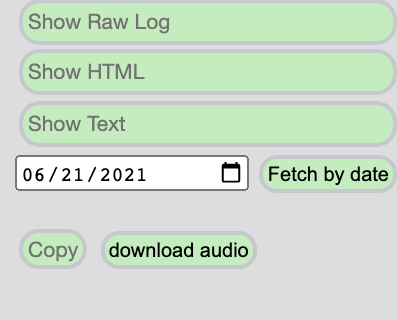

# Generate CCG Minutes

## Step 1: Create the date directory

Create the date directory inside the `meetings` repo:
- If adding minutes for the main CCG meeting, create a directory named `yyyy-mm-dd` (eg. `2020-12-01`)
- If adding minutes for a task force, add a suitable suffix to the directory name. Current suffices include:
    - vc-education
    - vchttpapi
    - traceability

Examples:
- For a main CCG meeting occuring on 2021-06-29: `2021-06-29`
- For a VC-EDU meeting occuring on 2021-06-28: `2021-06-28-vc-education`

## Step 2: Fetch and clean up the log file

Go to the [scribe tool](https://w3c-ccg.github.io/meetings/scribe-tool/) and enter the date of the meeting (see screenshot)



Check the following:
- Ensure there's a link to the agenda ("Agenda: ...")
- Ensure the topics are labeled ("Topic: ...")
- Ensure the scribe is identified ("Scribe: ...")
- Other IRC commands that are helpful when cleaning up minutes: [irc_ref.html](https://w3c-ccg.github.io/irc_ref.html)
- Look for any find/replace suggestions in irc.log and update them ("s/../..")
- Ensure aliases have matches (see [people.json file](https://github.com/w3c-ccg/meetings/blob/gh-pages/scribe-tool/people.json))
- Download the IRC log by doing the following:
    - Select and copy (you can use the copy button in the interface) the IRC log text
    - Paste into a new file on your computer using any text editor (eg. Notepad, TextEdit, Sublime Text)
    - Save it with the filename `irc.log` in the directory created above

## Step 3: Fetch and clean audio

Option 1: For the *main* meetings, use the "download audio" button (see above screenshot) and save in the directory created above as `audio.ogg`

> Note: could also add a feature to scribe-tool to support download of audio for task force meetings. For now, use the command line option (option 2)

Option 2: For main and other task force meetings, use the command line: use the `download-raw-minutes` tool in the `w3c-ccg/meetings` repository

```
# To download the audio for 2020-09-29 weekly meeting into 2020-09-29
./download-raw-minutes -a 2020-09-29

# To download the audio for 2020-11-02 education meeting into 2020-11-02-vc-education
./download-raw-minutes -a -m education 2020-11-02
```

The `audio.ogg` file will be placed into the correct directory automatically.


## Step 4: Create the group file

Create a text file in the created directory with the filename `group.txt`. The contents of this file tell the email-sending script what to put in the subject line when the minutes go out.

- For the regular weekly CCG call, it should say simply `Credentials CG`. 
- For task force calls use the appropriate name. Currently used options include
    - CCG Verifiable Credentials for Education Task Force
    - Verifiable Credentials HTTP API
    - Traceability Vocabulary

The automatic email sending won't happen without this.


## Step 5: Commit the files

- Ensure the log and audio files are placed into the github `meetings` repo as follows:
    - group: https://github.com/w3c-ccg/meetings/yyyy-mm-dd/group.txt
    - log: https://github.com/w3c-ccg/meetings/yyyy-mm-dd/irc.log
    - audio: https://github.com/w3c-ccg/meetings/yyyy-mm-dd/audio.ogg
    - Example: 
        - group: https://github.com/w3c-ccg/meetings/2020-11-17/group.txt
        - log: https://github.com/w3c-ccg/meetings/2020-11-17/irc.log
        - audio: https://github.com/w3c-ccg/meetings/2020-11-17/audio.ogg
- On commit, the rest is handled for you; a github action will generate html and publish

You can also update the minutes; changes to irc.log will trigger the github action and refresh the html.

> What it does:
> - ~Emails summary to ccg email group~ (BROKEN)
> - Tweets with the w3c_ccg account

## Step 6: Send the Email (manual workaround)

Take the contents of the email.log file that was generated and send the email to public-credentials@w3.org

